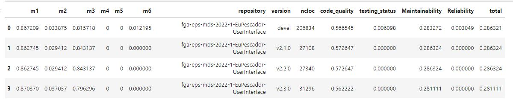
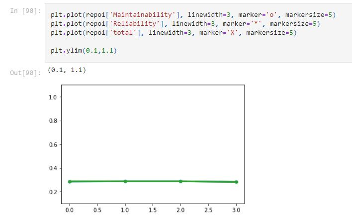

# Planejamento de Qualidade

## Histórico de versão

| Data | Versão | Modificação | Autor |
| :--: | :----: | :---------: | :---: |
| 05/09/2022 | 1.0 | Criação do documento | [Ailamar Alves](https://github.com/ailamaralves) |
| 12/09/2022 | 1.1 | Atualização das características de qualidade | [Ailamar Alves](https://github.com/ailamaralves) e [João Gabriel Antunes](https://github.com/flyerjohn) |
| 21/08/2022 | 1.2 | Configuração métricas Analytics | [André Freitas](https://github.com/Andreabenf) |
| 09/09/2022 | 1.3 | Configuração Q-Rapids | [André Freitas](https://github.com/Andreabenf) |
| 12/09/2022 | 1.4 | Atualização das características de qualidade | [Ailamar Alves](https://github.com/ailamaralves) e [João Gabriel Antunes](https://github.com/flyerjohn) |
| 12/09/2022 | 1.5 | Atualização das subcaracterísticas de qualidade | [Ailamar Alves](https://github.com/ailamaralves) e [João Gabriel Antunes](https://github.com/flyerjohn) |
| 12/09/2022 | 1.6 | Atualização avaliação de qualidade | [Ailamar Alves](https://github.com/ailamaralves) |

## Introdução

Desenvolver ou selecionar produtos de software de alta qualidade é de primordial importância (NBR ISO/IEC 9126-1:2003). A especificação e avaliação da qualidade do produto de software são fatores chave para garantir qualidade adequada que pode ser alcançado pela definição apropriada das características de qualidade.

## Objetivo

O objetivo da verificação da qualidade é garantir que o software faça aquilo que lhe é esperado, ao mesmo tempo que faça aquilo de maneira correta e que atenda as expectativas do(s) usuário(s). Para conduzir essa avaliação este documento utiliza a abordagem GQM (Goal Question Metrics). A escolha se dá pela facilidade de desenvolvimento bem como por ter suas etapas (Planejamento, Definição, Coleta de dados, Interpretação) bem claras durante o processo.
Em conjunto também foi utilizada a ferramenta Q-Rapids que define uma metodologia de desenvolvimento rápido de software com base em dados empíricos e com reconhecimento de qualidade.

## Características de Qualidade

A ISO/IEC 9126-1:2003 está centrada na qualidade do produto de software, e propõe atributos de qualidade, distribuídos em seis características principais. Das seis, três foram selecionadas para avaliação do EuPescador. São elas:

**Funcionalidade** – Funções do software, que determinam o que o sistema faz. Direcionada para o atendimento dos requisitos do usuário.  

**Manutenibilidade** - Medida do esforço necessário para fazer alterações, extensões e complementações no produto de software.  

**Confiabilidade** – Atributos que têm impacto na capacidade do sistema de manter o seu nível de desempenho, dentro de condições estabelecidas, por um dado período de tempo.

## Avaliação das características de qualidade

**FUNCIONALIDADE**

Subcaracterísticas que compõem a funcionalidade e métricas:

| Critério | Métrica | Interpretação |
| :------- | :------ | :------------ | 
| Adequação | Presença das funções especificadas | As duas versões do sistema apresentam a composição de funções orientada a tarefas a partir de suas subfunções e também possuem a capacidade de tabelas.
| Acurácia | O EuPescador gera resultados precisos, conforme o esperado | Ao final do semestre era esperado principalmente que o produto fosse capaz de fazer cadastros de espécies de modo offline e que fosse desenvolvido uma versão web para pesquisadores e cientistas. As metas foram atingidas.
| Interoperabilidade  | Capacidade de interagir com outros sistemas | O sistema tem compatibilidade de interação entre a aplicação web e mobile.
| Segurança de acesso | Capacidade para prevenir o acesso não autorizado | As duas versões do software protegem informações e dados dos usuários, garantindo a divisão de funções entre usuários administradores e usuários comuns, assim pessoas não autorizadas não podem ler, modificar ou acessar certos módulos do sistema.
| Conformidade | Observância a padrões, convenções ou regras estabelecidas | O sistema busca estar de acordo com as normas, convenções e regulamentações relacionadas à funcionalidade.

**MANUTENIBILIDADE E CONFIABILIDADE**

Subcaracterísticas que compõem a manutenibilidade:

| Critério | Descrição |
| :------- | :-------- | 
| Analisabilidade | Esforço necessário para diagnosticar deficiências ou causas de falhas |
| Modificabilidade | Esforço necessário para realizar alterações, remover falhas ou para adequar o produto a mudanças de ambiente operacional |
| Estabilidade | Medida do risco de efeitos inesperados provenientes de modificações |
| Testabilidade | Esforço necessário para testar o software alterado |
| Conformidade | Capacidade do software de estar de acordo com normas ou convenções relacionadas à manutenibilidade. |

Subcaracterísticas que compõem a confiabilidade:

| Critério | Descrição |
| :------- | :-------- | 
| Maturidade | Baixa frequência de falhas |
| Tolerância a falhas | Capacidade de manter determinados níveis de desempenho mesmo na presença de problemas |
| Recuperabilidade | Capacidade de restabelecer o nível de desempenho desejado e recuperar dados em caso de ocorrência de falha |
| Conformidade | Capacidade de estar de acordo com normas ou convenções relacionadas à confiabilidade. |

Para realizar a medição da manutenibilidade e confiabilidade em cada um dos repositórios, o processo foi feio de maneira automática. As métricas foram coletadas através do SonarCloud atualizadas a cada *Pull Request* após o *merge* no repositório. Com essas coletas integradas ao notebook da disciplina foi possível obter as seguintes análises de dados:

- Os dados a seguir são referentes apenas ao repositório principal com maior número de versões [EuPescador-UserInterface](https://github.com/fga-eps-mds/2022.1-EuPescador-UserInterface). Para maiores detalhes da avaliação acesse [*Analytics - Product Quality*](https://github.com/fga-eps-mds/2022-1-EuPescador-Doc/blob/main/analytics-results/analytics.ipynb).

**Fator de qualidade e agregação de aspectos**

## Referências

- QUALIDADE DO SOFTWARE (PRODUTO). Baseado no material do prof. Mario Lúcio Cortes. Unicamp. Disponível em: <http://www.unimep.br/~anbelgamo/SQA/2-QualidProduto.pdf>. Acesso em: set, 2022.
- ISO/IEC 9126. Disponível em: <https://pt.wikipedia.org/wiki/ISO/IEC_9126#:~:text=ISO%2FIEC%209126%20%C3%A9%20uma,das%20normas%20da%20fam%C3%ADlia%209000>. Acesso em: set, 2022.
- NBR ISO/IEC 9126-1 - Engenharia de software - Qualidade de
produto. Disponível em: <https://jkolb.com.br/wp-content/uploads/2014/02/NBR-ISO_IEC-9126-1.pdf>. Acesso em: set, 2022.
- Goal Question Metric Approach in Software Quality. Disponível em: <https://www.geeksforgeeks.org/goal-question-metric-approach-in-software-quality/>. Acesso em: set, 2022.
