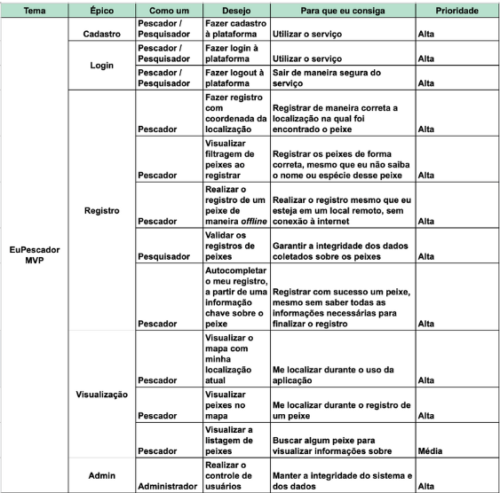

# Backlog

## Histórico de versão
| Data | Versão | Modificação | Autor |
| :--: | :----: | :---------: | :---: |
| 20/07/2022 | 1.0 | Criação do documento | Todos de MDS e EPS |
| 17/08/2022 | 1.1 | Documentação do artefato | [Lucas Ganda Carvalho](https://github.com/lucasgandac) |
| 18/08/2022 | 1.2 | Adição da definição de backlog do produto | [João Gabriel Antunes](https://github.com/flyerjohn) |

## Introdução

O projeto iniciou com a Lean Inception, que é um workshop colaborativo dividido em várias etapas e atividades, que através de reuniões e debates, serviu pra direcionar e orientar a equipe na construção do produto.

Após a Lean Inception, foi possível definir o backlog do produto e definir as histórias de usuários a serem desenvolvidas durante o projeto, além das melhorias e dos bugs.

## Backlog do produto

Em termos gerais, o Product BackLog é uma listagem de todos os afazeres pendentes no projeto. Ele substitui o modelo tradicional de especificação de artefatos. Cada elemento da listagem é elicitado por meio de interação da equipe de desenvolvimento com o Cliente - podendo ser apenas um representante, o que torna os elementos levantados muito arbitrários; ou podendo ser uma equipe representante do Cliente, representando as diversas áreas que utilizarão o produto.

## Histórias de Usuário

Uma história do usuário é uma explicação informal sobre uma determinada funcionalidade ou recurso de um software do ponto de vista de um usuário . Seu objetivo é facilitar o entendimento de como o recurso gera valor ao usuário.

## Referências

- REHKOPF, Max. Histórias de usuários com exemplos e um template. Disponível em https://www.atlassian.com/br/agile/project-management/user-stories. Acesso em: 17 ago. 2022.

- RADIGAN, Dan. O backlog do produto: sua lista de tarefas definitiva. Disponível em https://www.atlassian.com/br/agile/scrum/backlogs. Acesso em: 17 ago. 2022.

- NARECHANIA, Nishal. The Fundamentals of User Stories and Product Backlogs. Disponível em https://medium.com/nsquared-labs/user-stories-and-the-product-backlog-in-scrum-c87d36df4b96. Acesso em: 17 ago. 202
