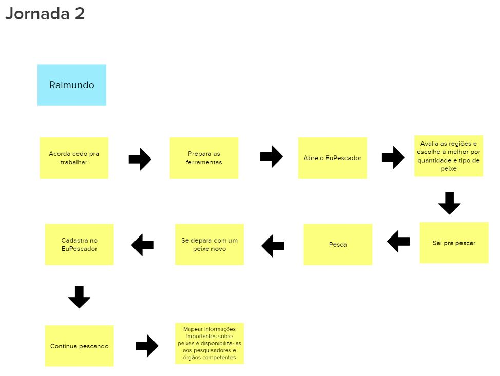

# Documento de Visão

## Histórico de versão
| Data | Versão | Modificação | Autor |
| :--: | :----: | :---------: | :---: |
| 12/07/2022 | 1.0 | Criação do documento | Ailamar Alves |
| 18/07/2022 | 1.1 | Adição introdução e definições | Ailamar Alves |
| 20/07/2022 | 1.2 | Adição imagens | Ailamar Alves |

## Introdução

Lean Inception é a combinação eficaz do Design Thinking e do Lean StartUp para decidir o Produto Mínimo Viável (MVP). É um workshop colaborativo dividido em várias etapas e atividades que irão direcionar a equipe na construção do produto.

## Objetivo

Esse documento objetiva-se apresentar as funcionalidades inicialmente pensadas para a página web do EuPescador.

## Visão do Produto 

A visão do produto ajuda a trilhar o caminho inicial do projeto. Ela define a essência do valor de negócio e reflete uma mensagem clara para os clientes. Com uma visão clara do produto, é possível determinar como as peças do negócio vão se juntar.

A partir do produto já existente e suas devidas melhorias, a equipe desenvolveu a seguinte visão do produto:

## É - Não é / Faz - Não faz

É uma atividade que busca classificações sobre o produto seguindo as quatro diretrizes, indagando, especificamente, cada aspecto positivo e negativo sobre o produto ser ou fazer algo.

Inicialmente temos a classificação do que o produto é e faz:

Decidir o que não fazer é tão importante quanto decidir o que fazer. Sendo assim temos:

## Objetivos do Produto

Nesta atividade cada integrante da equipe compartilha o que entende como objetivo para o produto. Os vários pontos de vista
devem ser discutidos para chegar a um consenso sobre o que é realmente importante para levantamento e esclarecimento dos objetivos.

Os integrantes listaram três objetivos para o negócio, que resultou em:

Agrupando cada objetivo por similaridade, foi criado o cluster:

## Personas

Uma persona cria uma representação realista de usuários, auxiliando a equipe a descrever funcionalidades do ponto de vista de quem vai interagir com o produto final. Uma persona representa um usuário do produto, descrevendo não só o seu papel, mas também características e necessidades. 

Para efetivamente identificar as funcionalidades necessárias, foram criados dois tipos de usuários e seus respectivos papéis na utilização do produto:

- Persona 1 representando um usuário pesquisador.

- Persona 2 representando um usuário pescador.

## Jornada do Usuário

Esta atividade descreve o percurso de um usuário por uma sequência de passos para alcançar seu objetivo. Os passos representam diferentes pontos de contato com o produto, caracterizando a interação da pessoa com ele. 

- Objetivo que a persona 1 busca alcançar.

- Objetivo que a persona 2 busca alcançar.

## Brainstorming de Funcionalidades

Uma funcionalidade representa uma ação ou interação de um usuário com o produto, por exemplo: imprimir nota fscal, consultar extrato detalhado e convidar amigos do Facebook. A descrição de uma funcionalidade deve ser o  mais simples possível, visando atender um objetivo de negócio, uma necessidade da persona, e/ou contemplando um passo da jornada.

O usuário está tentando fazer uma coisa, então o produto deve ter uma funcionalidade para isso.

## Revisão Técnica, de Negócio e UX

## Sequenciador

## MVP CANVAS

## Lean Inception

Para visualizar o mural completo acesse o [link](https://app.mural.co/t/unbfgaepsmds202111846/m/unbfgaepsmds202111846/1654695732969/c0a887fc3609c105085272211893e4cbcba497e5?invited=true&sender=u114ae1e60ee038ecd8c71344).

## Referências

- CAROLI, Paulo. Lean Inception: Como Alinhar Pessoas e Construir o Produto Certo. Caroli. Disponível em https://www.caroli.org/livro/lean-inception/. Acesso em: 12 jul. 2022.