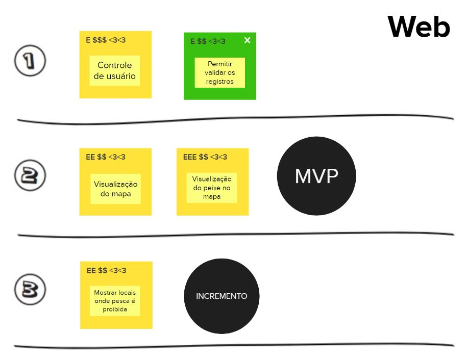

# Documento de Visão

## Histórico de versão
| Data | Versão | Modificação | Autor |
| :--: | :----: | :---------: | :---: |
| 12/07/2022 | 1.0 | Criação do documento | Ailamar Alves |
| 18/07/2022 | 1.1 | Adição introdução e definições | Ailamar Alves |
| 20/07/2022 | 1.2 | Adição imagens | Ailamar Alves |

## Introdução

Lean Inception é a combinação eficaz do Design Thinking e do Lean StartUp para decidir o Produto Mínimo Viável (MVP). É um workshop colaborativo dividido em várias etapas e atividades que irão direcionar a equipe na construção do produto.

## Objetivo

Esse documento objetiva-se apresentar as funcionalidades inicialmente pensadas para a página web do EuPescador.

## Visão do Produto 

A visão do produto ajuda a trilhar o caminho inicial do projeto. Ela define a essência do valor de negócio e reflete uma mensagem clara para os clientes. Com uma visão clara do produto, é possível determinar como as peças do negócio vão se juntar.

A partir do produto já existente e suas devidas melhorias, a equipe desenvolveu a seguinte visão do produto:

## É - Não é / Faz - Não faz

É uma atividade que busca classificações sobre o produto seguindo as quatro diretrizes, indagando, especificamente, cada aspecto positivo e negativo sobre o produto ser ou fazer algo.

Inicialmente temos a classificação do que o produto é e faz:

Decidir o que não fazer é tão importante quanto decidir o que fazer. Sendo assim temos:

## Objetivos do Produto

Nesta atividade cada integrante da equipe compartilha o que entende como objetivo para o produto. Os vários pontos de vista
devem ser discutidos para chegar a um consenso sobre o que é realmente importante para levantamento e esclarecimento dos objetivos.

Os integrantes listaram três objetivos para o negócio, que resultou em:

Agrupando cada objetivo por similaridade, foi criado o cluster:

## Personas

Uma persona cria uma representação realista de usuários, auxiliando a equipe a descrever funcionalidades do ponto de vista de quem vai interagir com o produto final. Uma persona representa um usuário do produto, descrevendo não só o seu papel, mas também características e necessidades. 

Para efetivamente identificar as funcionalidades necessárias, foram criados dois tipos de usuários e seus respectivos papéis na utilização do produto:

- Persona 1 representando um usuário pesquisador.

- Persona 2 representando um usuário pescador.

- Persona 3 representando um usuário pescador.

## Jornada do Usuário

Esta atividade descreve o percurso de um usuário por uma sequência de passos para alcançar seu objetivo. Os passos representam diferentes pontos de contato com o produto, caracterizando a interação da pessoa com ele. 

- Objetivo que a persona 1 busca alcançar.

## Brainstorming de Funcionalidades

O brainstorming é uma técnica que propõe uma reunião com a equipe de projeto visando estimular a criação de ideias, voltadas a resolução do problema em questão. Assim é possível explorar potenciais soluções entre os membros e observar o problema de seus vários ângulos. 

Para auxílio da visão do projeto foi feito um brainstorming levantado as funcionalidades do EuPescador. Essas funcionalidades visam atender os objetivo de negócio, as necessidades das personas, e/ou um passo da jornada.

As funcionalidades levantadas foram:

## Revisão Técnica, de Negócio e UX

Possui o objetivo de discutir como a equipe se sente em relação ao entendimento técnico, o de negócio e o de UX para cada funcionalidade. Nesta atividade, novas notas serão capturadas e as discordâncias e dúvidas ficarão mais aparentes.

As funcionalidades foram listadas na imagem abaixo. As cores indicam o nível de confança, sendo verde maior confiança para desenvolvimento e vermelho menor confiança para desenvolvimento.

## Sequenciador

O Sequenciador de funcionalidades auxilia na organização e visualização das funcionalidades e da sequência de validação incremental de desenvolvimento do produto. 

Inicialmente tem-se as funcionalidades trabalhadas no MVP e em seguida seus incrementos subsequentes. O sequenciador foi dividido para a aplicação mobile e web.

- Sequenciador aplicação mobile.

- Sequenciador aplicação web.

## MVP CANVAS

Este é um quadro visual que auxilia a alinhar e defnir a estratégia do MVP. Apresenta um resumo sobre o que foi discutido, o que compõe o MVP e o que esperar dele.

- Canvas MVP aplicação mobile.

- Canvas MVP aplicação mobile. 

## Lean Inception

Para visualizar o mural completo acesse o [link](https://app.mural.co/t/unbfgaepsmds202111846/m/unbfgaepsmds202111846/1654695732969/c0a887fc3609c105085272211893e4cbcba497e5?invited=true&sender=u114ae1e60ee038ecd8c71344).

## Referências

- CAROLI, Paulo. Lean Inception: Como Alinhar Pessoas e Construir o Produto Certo. Caroli. Disponível em https://www.caroli.org/livro/lean-inception/. Acesso em: 12 jul. 2022.
