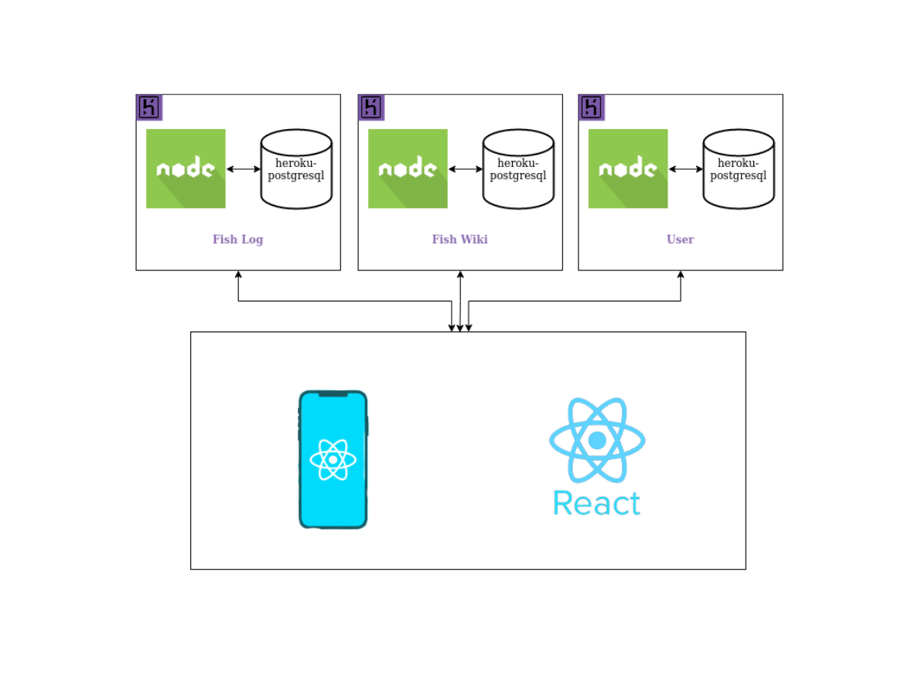

# Definições Arquiteturais

## Histórico de versão
| Data | Versão | Modificação | Autor |
| :--: | :----: | :---------: | :---: |
| 03/08/2022 | 1.0 | Criação do diagrama | André Freitas |
| 08/08/2022 | 1.1 | Criação do documento | Lucas Ganda |

## Introdução

 Esse documento tem como finalidade apresentar uma visão arquitetural do projeto EuPescador, facilitando dessa forma o entendimento do funcionamento dos processos envolvidos, além também tem como objetivo servir como uma atualização em relação ao documento anteriormente produzido [no semestre 2021-2](https://fga-eps-mds.github.io/2021-2-Eu_Pescador-Doc/#/Product/ArchitectureDocument). Neste documento estará descritos os componentes, as estruturas e as tecnologias envolvidas no funcionamento do sistema.

## Escopo

O projeto do EuPescador é constituído por um sistema compostos de uma aplicação web e uma mobile que tem como finalidade principal permitir o registro, visualização e validação de espécimes aquáticos. Dessa forma facilitando o acompanhamento de ecossistemas aquáticos por parte dos pesquisadores a partir de informações fornecidas em campo por pescadores.

## Tecnologias 

### Expo

Expo é uma plataforma que permite o desenvolvimento de aplicações mobile para Android e iOs.

### Node.js

O Node.js é um ambiente de execução JavaScript server-side que permite executar código Javascript ou Typescript fora do navegador, dessa forma permitindo construir aplicações web variadas, como APIs ou microsserviços. 

### PostgreSQL

PostgreSQL é um sistema gerenciador de banco de dados relacional <em>open-source</em> e gratuito, um dos mais avançados e completos de código aberto.

### Heroku

A Heroku é uma plataforma nuvem que faz deploy de várias aplicações back-end seja para hospedagem, testes em produção ou escalar aplicações, também possui integraação com o Github.

### React Native

React Native é uma framework baseada no Javascript que tem como finalidade facilitar o desenvolvimeto de aplicações mobiles multiplataformas.

### React

React é uma biblioteca baseada no Javascript que tem como finalidade auxiliar na criação de interfaces para aplicações web, lançada e mantida pelo Facebook

## Diagrama

## Referências

Guia Completa de PostgreSQL: PostgreSQL do Básico ao Avançado. DevMedia. Disponível em: <https://www.devmedia.com.br/guia/tecnologia-postgresql/34328>. Acesso em: 8  ago.  2022.

Guia Completo de Node.js: Aprenda Node.js do Básico ao Avançado. DevMedia. Disponível em: <https://www.devmedia.com.br/guia/node-js/40312>. Acesso em: 8  ago.  2022.

Documento de Arquitetura. Eu_Pescador. Disponível em: https://fga-eps-mds.github.io/2021-2-Eu_Pescador-Doc/#/Product/ArchitectureDocument. Acesso em: 8 ago. 2022.

Como documentar a Arquitetura de Software. Disponível em: http://www.linhadecodigo.com.br/artigo/3343/como-documentar-a-arquitetura-de-software.aspx. Acesso em: 8 ago. 2022.