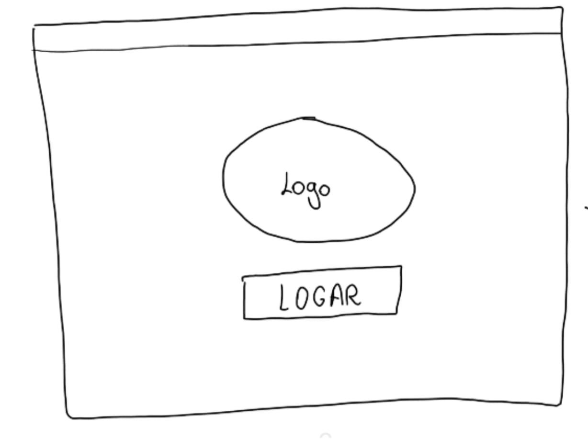
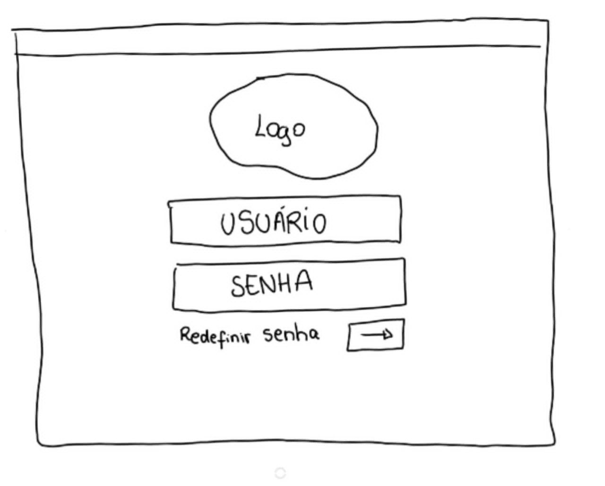
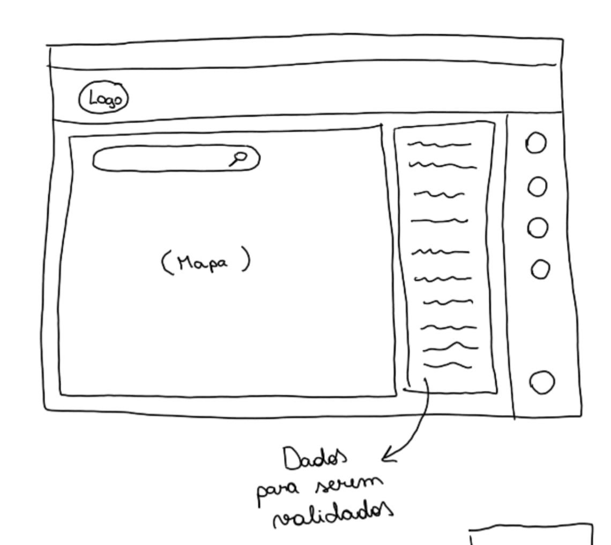
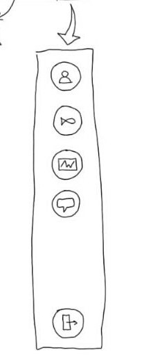
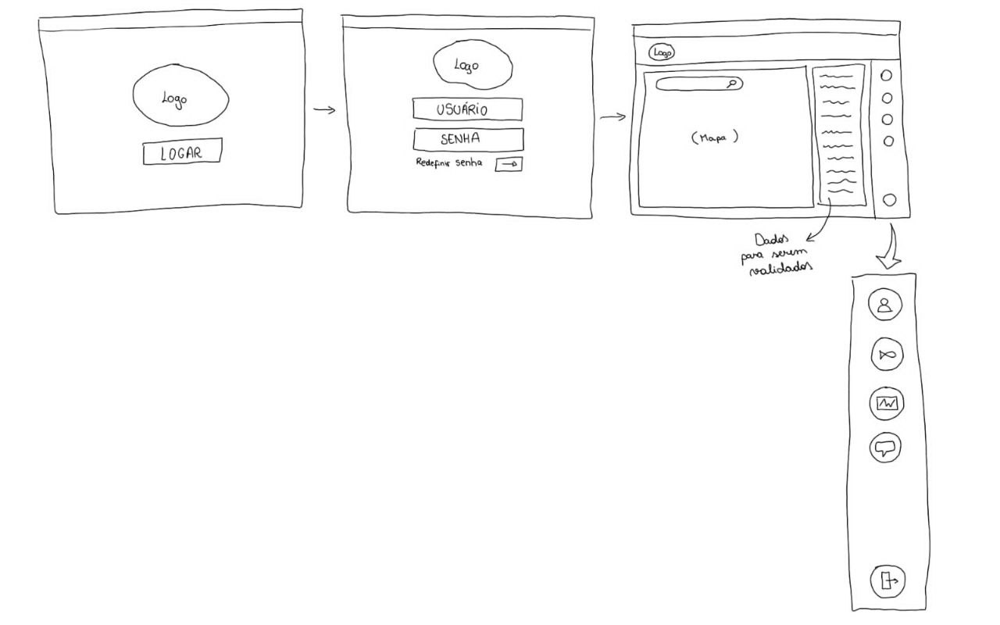

# Protótipo de Papel

## Histórico de versão
| Data | Versão | Modificação | Autor |
| :--: | :----: | :---------: | :---: |
| 14/07/2022 | 1.0 | Criação do documento | Ailamar Alves |
| 26/07/2022 | 1.1 | Alteração das imagens | Ailamar Alves |

## Introdução

A prototipagem de papel é uma técnica que permite criar e testar interfaces de usuário de forma rápida e barata em que os protótipos, de papel, geram um excelente feedback de observação sobre o comportamento do usuário em relação ao design. Foi utilizada no desenvolvimento da prototipação a base de funcionalidades já existentes na versão mobile.

## Objetivo

Esse documento objetiva apresentar as funcionalidades inicialmente pensadas para a página web do EuPescador.

## Protótipo 

### Página login

### Página de cadastro

### Mapa de peixes

### Barra de menu

### Fluxo geral

## Referências

- MEDIUM. Protótipos de Papel. Disponível em: https://medium.com/aela/prototipos-de-papel-9f812d5b0dcc. Acesso em: 14 jul. 2022.