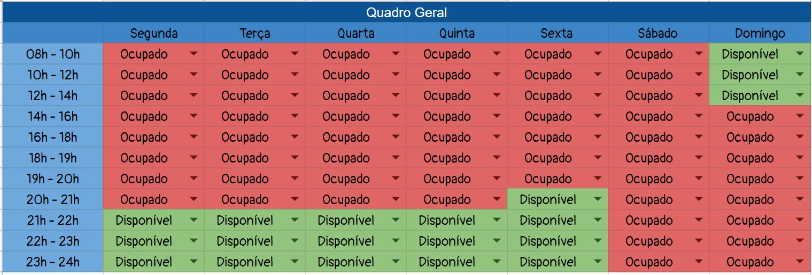
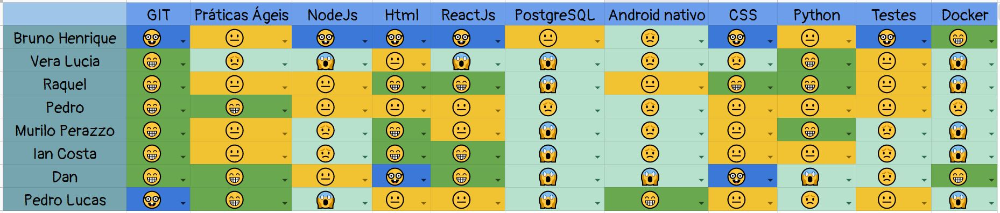
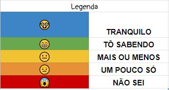

# Gestão da Equipe 

## Histórico de versão
| Data | Versão | Modificação | Autor |
| :--: | :----: | :---------: | :---: |
| 13/07/2022 | 1.0 | Criação do documento | Ailamar Alves |

## Objetivo

Este documento tem o objetivo de padronizar as formas de comunicação interna entre os integrantes da equipe, ou seja, como e por onde ocorrerá a comunicação dos integrantes do grupo durante a produção do trabalho. Também visa formalizar os meios de comunicação entre os membros do projeto e os stakeholders.

Para controle da produtividade, é apresentado o quadro de conhecimento dos integrantes indicando quais são os pontos de maior e menor dificuldade para a equipe.

## Gerenciamento de Comunicação

### Grade horária

Para alinhar o dia das reuniões foi elaborada uma tabela de disponibilidade determinando os melhores horários para as reuniões em grupo e com o cliente. A agenda livre em comum para todos ficou inviável por ser muito tarde como mostrado na figura: 

Devido ao tamanho da equipe foi determiado o horário da reunião com a possibilidade do maior número de integrantes. Dessa forma, ficou definido:
- As reuniões do grupo de EPS/MDS duas vezes na semana;
- As reuniões com o cliente acontecem todas às sextas das 17 às 18 horas.

### Ferramentas utilizadas

|     Ferramenta       |                          Descrição                           |
| :------------------: | :----------------------------------------------------------- |
|  | Ferramenta para realização de reuniões entre o time e cliente. |
|  | Ferramenta para de mensagens rápidas. O time utiliza a ferramenta para compartilhamento de arquivos, links, marcar reuniões internas, atualizações.|
|  | Ferramenta de voz para bate-papo entre os usuários. O time utiliza essa ferramentas para tirar dúvidas ou passar informações do projeto com cliente e com o professor. |
|  | Ferramenta utilizada para edição e armazenamento de documentos. |
|  | A plataforma é utilizada para centralização da documentação, código e controle de versão. |

## Gestão de Conhecimento

Para determinar quais treinamentos a equipe precisaria, foi realizado o Quadro de Conhecimento com o time de MDS. De acordo com a necessidade serão feitos encontros para apresentação e intruções sobre as tecnologias utilizadas na disciplina. 

Ao decorrer do semestre o quadro pode ser alterado para verificar a evolução da equipe e para observar possíveis riscos de atraso causado pela falta de instrução do desenvolvedor.

### Quadro de conhecimento

O quadro gerado pela equipe, inicialmente, foi:

